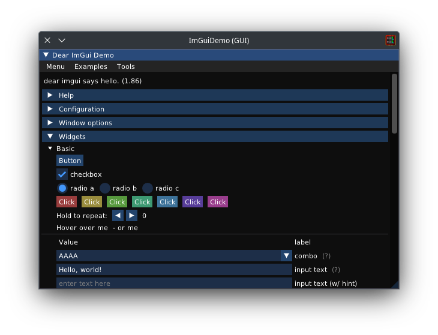
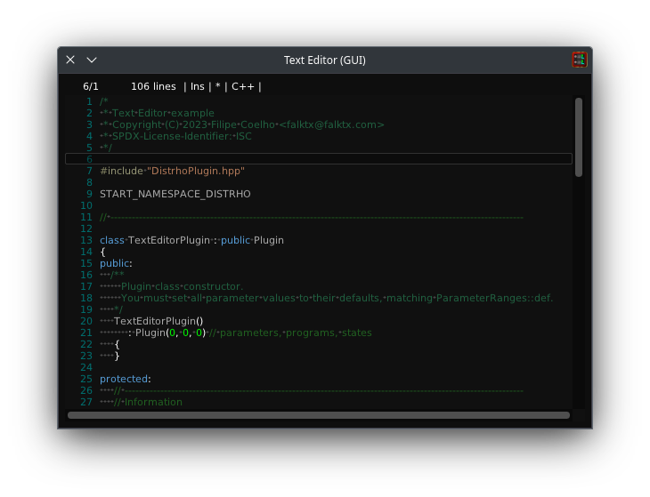
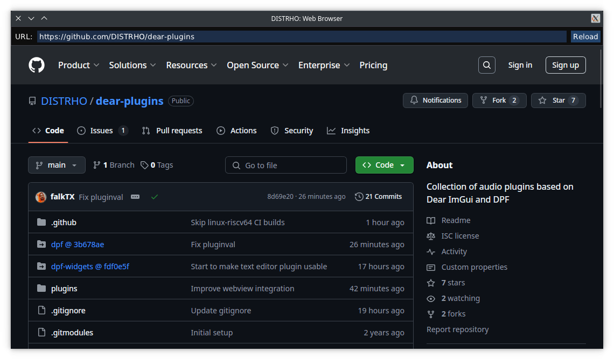

# DISTRHO Dear Plugins

A collection of audio plugins based on existing [Dear ImGui](https://github.com/ocornut/imgui) widgets,
created with the main purpose of demonstrating and testing ImGui widgets integration in DISTRHO's Plugin Framework (DPF for short).

This is very much WORK IN PROGRESS!

This collection currently includes: 
 - ImGui Demo
 - Text Editor

## ImGui Demo

Exposes the ImGui demo window directly as a plugin GUI, DSP side simply passes through the audio unmodified.

This is useful for testing UI events and interaction for all internal ImGui widgets.

## Text Editor

Exposes the Text Editor as available in the [DPF-Widgets](https://github.com/DISTRHO/DPF-Widgets) repository, which uses ImGui behind the scenes.
The contents of the editor is saved as plugin state, but otherwise DSP side also does nothing.

## Web Browser

Uses ImGui for URL entry and controls on top of DPF's internal WebView implementation.
The manually-written URL is saved as plugin state, but otherwise DSP side also does nothing.

